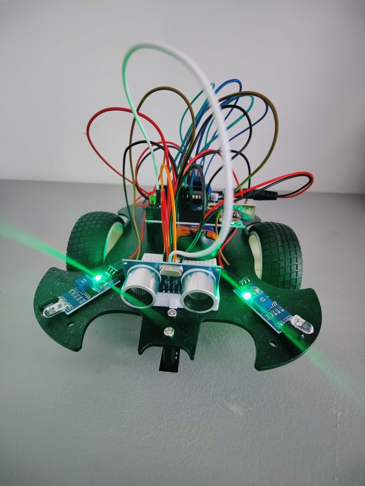

# Self-Driving Car
In this project, I have built a self-driving car using an Arduino UNO and Sunfounder's IoT kit. The goal of the project is to create a small-scale autonomous vehicle that can navigate a predefined track without human intervention. The car is equipped with sensors and actuators to detect and respond to its environment, allowing it to follow the track, avoid obstacles, and make decisions on its own.

| **Engineer** | **School** | **Area of Interest** | **Degree** |
|:--:|:--:|:--:|:--:|
| Remston D. | New York University | Computer Science | Master of Science

**Here is an autonomous self-driving car that I built using ARDUINO UNO and SUNFOUNDER'S tool kit**


  
# Final Milestone
Since the previous milestone, several accomplishments have been made in the self-driving car project:

    1. Implementation of the self-driving functionality: The code was successfully uploaded, and the car can now drive autonomously. It utilizes the IR obstacle avoidance modules and the ultrasonic module to detect and avoid obstacles during its movement.
    2. Enhanced obstacle avoidance capabilities: The car is programmed to respond appropriately when obstacles are detected. It can back up, adjust its direction, and continue moving forward while avoiding collisions.

Challenges and Triumphs:

    1. Challenges: One of the main challenges faced during this project was fine-tuning the obstacle detection and avoidance algorithm. Ensuring reliable obstacle detection and designing an effective evasion strategy required experimentation and iterative improvements.
    2. Triumphs: Overcoming the challenges and achieving a functional self-driving car was a significant triumph. The successful integration of different components, such as the IR modules and ultrasonic module, and the development of the control logic to navigate the car autonomously were notable accomplishments.

Key Topics Learned:

    1. Hardware integration: Understanding how to connect and wire different hardware components, such as motors, sensors, and microcontrollers, to create a functional system.
    2. Sensor integration and data processing: Learning how to interface with sensors, read their data, and process it to make informed decisions and control the car's movements.
    3. Algorithm design: Designing algorithms and control logic to enable autonomous behavior, obstacle detection, and evasion strategies.

Future Learning Goals:

After completing the self-driving car project at BSE, there are several areas to explore and learn further:

    1. Advanced autonomous navigation: Diving deeper into advanced algorithms and techniques for autonomous navigation, including path planning, mapping, and localization.
    2. Machine learning for self-driving cars: Exploring machine learning approaches, such as deep learning and reinforcement learning, to enhance the car's perception and decision-making capabilities.
    3. Real-world applications: Applying the knowledge gained to real-world scenarios and challenges, such as developing self-driving car prototypes for specific environments or tasks.

By continuing to explore these areas, I hope to deepen my understanding of autonomous systems, contribute to the field of self-driving technology, and stay up to date with the latest advancements in the industry.


<!-- **Don't forget to replace the text below with the embedding for your milestone video. Go to Youtube, click Share -> Embed, and copy and paste the code to replace what's below.**

<iframe width="560" height="315" src="https://www.youtube.com/embed/F7M7imOVGug" title="YouTube video player" frameborder="0" allow="accelerometer; autoplay; clipboard-write; encrypted-media; gyroscope; picture-in-picture; web-share" allowfullscreen></iframe> -->

# Second Milestone
- Technical Details: Since the first milestone, I have focused on the technical aspects of the self-driving car project. I have successfully wired the components, including motors, sensors, and the Arduino UNO, ensuring proper connections for power and signals. I have also written code to control the car's movements based on sensor inputs, incorporating obstacle detection and avoidance logic using the ultrasonic module and IR obstacle avoidance modules.
- Surprising Discoveries: Throughout the project, I have been pleasantly surprised by the capabilities of the components and the effectiveness of the implemented algorithms. Seeing the car autonomously detect and avoid obstacles has been a rewarding experience.
- Overcoming Challenges: In the second milestone, I faced challenges in wiring the components correctly and ensuring reliable connections. However, by carefully following the instructions and double-checking the connections, I was able to overcome these challenges and establish a solid hardware setup.
- Remaining Tasks: Before the final milestone, there are a few tasks that need to be completed. Firstly, I need to calibrate the sensors to ensure accurate readings and fine-tune the code for optimal performance. Additionally, comprehensive testing in various scenarios will be conducted to identify any potential issues or limitations that need to be addressed. Finally, I will iterate on the project to further improve its capabilities and refine the self-driving functionality.

<!-- **Don't forget to replace the text below with the embedding for your milestone video. Go to Youtube, click Share -> Embed, and copy and paste the code to replace what's below.**

<iframe width="560" height="315" src="https://www.youtube.com/embed/y3VAmNlER5Y" title="YouTube video player" frameborder="0" allow="accelerometer; autoplay; clipboard-write; encrypted-media; gyroscope; picture-in-picture; web-share" allowfullscreen></iframe> -->

# First Milestone: Self-Driving Car Assembly and Basic Functionality
- Technical Progress:
In the first milestone, the focus was on assembling the car chassis and establishing basic functionality. The car chassis was assembled following the provided instructions, including mounting the motors, wheels, L298N module, IR obstacle avoidance modules, and the Line Track module. The Arduino UNO was also integrated into the car.
- Challenges and Future Milestones:
One of the challenges faced in the first milestone was ensuring proper alignment and attachment of the components to the chassis. This required careful following of the assembly instructions and attention to detail.
- In future milestones, the challenges to be addressed include:

        1. Wiring the components correctly and ensuring reliable connections.
        2. Writing code to control the car's movements, obstacle detection, and avoidance.
        3. Calibrating the sensors for accurate readings.
        4. Testing and fine-tuning the car's performance to achieve smooth and efficient self-driving capabilities.

- Plan to Complete the Project:
  To complete the project, the following steps will be taken in subsequent milestones:

        1. Wiring: Properly connect the components, including motors, sensors, and the Arduino UNO, ensuring correct power supply and signal connections.
        2. Coding: Write the necessary code to control the car's movements based on sensor inputs. This includes implementing obstacle detection and avoidance logic using the ultrasonic module and IR obstacle avoidance modules.
        3. Calibration and Testing: Calibrate the sensors to ensure accurate readings and test the car's functionality in different scenarios. Fine-tune the code and make any necessary adjustments to achieve optimal performance.
        4. Iterative Improvement: Continuously refine and improve the self-driving car's capabilities, incorporating feedback and addressing any issues or limitations encountered during testing.

<!-- **Don't forget to replace the text below with the embedding for your milestone video. Go to Youtube, click Share -> Embed, and copy and paste the code to replace what's below.**

<iframe width="560" height="315" src="https://www.youtube.com/embed/Z8zcQtiViqU" title="YouTube video player" frameborder="0" allow="accelerometer; autoplay; clipboard-write; encrypted-media; gyroscope; picture-in-picture; web-share" allowfullscreen></iframe> -->

<!-- # Schematics 
Here's where you'll put images of your schematics. [Tinkercad](https://www.tinkercad.com/blog/official-guide-to-tinkercad-circuits) and [Fritzing](https://fritzing.org/learning/) are both great resoruces to create professional schematic diagrams, though BSE recommends Tinkercad becuase it can be done easily and for free in the browser.  -->

# Code
The car will drive freely once the code has been uploaded successfully. When the IR obstruction module on both sides detects an obstacle, it will move in the opposite direction for emergency evasion; if there is an obstacle within 2~10cm directly in front of the car, it will back up to the left, adjust its direction, and then move forward.
```c++
const int in1 = 5;
const int in2 = 6;
const int in3 = 9;
const int in4 = 10;

const int echoPin = 4;
const int trigPin = 3;

const int rightIR = 7;
const int leftIR = 8;

float readSensorData() {
  digitalWrite(trigPin, LOW);
  delayMicroseconds(2);
  digitalWrite(trigPin, HIGH);
  delayMicroseconds(10);
  digitalWrite(trigPin, LOW);
  float distance = pulseIn(echoPin, HIGH) / 58.00; //Equivalent to (340m/s*1us)/2
  return distance;
}


void moveForward(int speed) {
  analogWrite(in1, 0);
  analogWrite(in2, speed);
  analogWrite(in3, speed);
  analogWrite(in4, 0);
}

void moveBackward(int speed) {
  analogWrite(in1, speed);
  analogWrite(in2, 0);
  analogWrite(in3, 0);
  analogWrite(in4, speed);
}


void backLeft(int speed) {
  analogWrite(in1, speed);
  analogWrite(in2, 0);
  analogWrite(in3, 0);
  analogWrite(in4, 0);
}

void backRight(int speed) {
  analogWrite(in1, 0);
  analogWrite(in2, 0);
  analogWrite(in3, 0);
  analogWrite(in4, speed);
}

void stopMove() {
  analogWrite(in1, 0);
  analogWrite(in2, 0);
  analogWrite(in3, 0);
  analogWrite(in4, 0);
}

void setup() {
  Serial.begin(9600);

  //motor
  pinMode(in1, OUTPUT);
  pinMode(in2, OUTPUT);
  pinMode(in3, OUTPUT);
  pinMode(in4, OUTPUT);

  //ultrasonic
  pinMode(echoPin, INPUT);
  pinMode(trigPin, OUTPUT);

  //IR obstacle
  pinMode(leftIR, INPUT);
  pinMode(rightIR, INPUT);
}

void loop() {

  int left = digitalRead(leftIR);  // 0: Obstructed   1: Empty
  int right = digitalRead(rightIR);

  if (!left && right) {
    backLeft(150);
  } else if (left && !right) {
    backRight(150);
  } else if (!left && !right) {
    moveBackward(150);
  } else {
    float distance = readSensorData();
    Serial.println(distance);
    if (distance > 50) { // Safe
      moveForward(200);
    } else if (distance < 10 && distance > 2) { // Attention
      moveBackward(200);
      delay(1000);
      backLeft(150);
      delay(500);
    } else {
      moveForward(150);
    }
  }
}
```
<!-- 
# Bill of Materials
Here's where you'll list the parts in your project. To add more rows, just copy and paste the example rows below.
Don't forget to place the link of where to buy each component inside the quotation marks in the corresponding row after href =. Follow the guide [here]([url](https://www.markdownguide.org/extended-syntax/)) to learn how to customize this to your project needs. 

| **Part** | **Note** | **Price** | **Link** |
|:--:|:--:|:--:|:--:|
| Item Name | What the item is used for | $Price | <a href="https://www.amazon.com/Arduino-A000066-ARDUINO-UNO-R3/dp/B008GRTSV6/"> Link </a> |
|:--:|:--:|:--:|:--:|
| Item Name | What the item is used for | $Price | <a href="https://www.amazon.com/Arduino-A000066-ARDUINO-UNO-R3/dp/B008GRTSV6/"> Link </a> |
|:--:|:--:|:--:|:--:|
| Item Name | What the item is used for | $Price | <a href="https://www.amazon.com/Arduino-A000066-ARDUINO-UNO-R3/dp/B008GRTSV6/"> Link </a> |
|:--:|:--:|:--:|:--:|

# Other Resources/Examples
One of the best parts about Github is that you can view how other people set up their own work. Here are some past BSE portfolios that are awesome examples. You can view how they set up their portfolio, and you can view their index.md files to understand how they implemented different portfolio components.
- [Example 1](https://trashytuber.github.io/YimingJiaBlueStamp/)
- [Example 2](https://sviatil0.github.io/Sviatoslav_BSE/)
- [Example 3](https://arneshkumar.github.io/arneshbluestamp/)

To watch the BSE tutorial on how to create a portfolio, click here. -->
